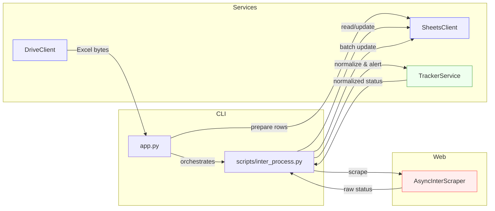

# Architecture / Arquitectura

## Components / Componentes
- app.py: CLI orchestrator. Supports sync and async flows.
- scripts/inter_process.py: async runner with concurrency, RPS, batching.
- services/sheets_client.py: Google Sheets operations, batched writes, daily report.
- services/drive_client.py: Google Drive helper to locate and download daily Excel.
- services/tracker_service.py: normalization rules, alert computation, decisions.
- web/inter_scraper_async.py: Playwright async scraper, robust iframe handling, retries.

## Data flow / Flujo de datos
1) Source (Drive/Sheet)
2) Scrape Interrapidísimo (raw)
3) Normalize to catalog (business)
4) Batch write to Sheet
5) Logs + audit CSV

## Key decisions / Decisiones clave
- Async Playwright with bounded concurrency and RPS to control resource use.
- Batch updates by column and consecutive row blocks to minimize API calls and avoid clearing cells.
- Normalization driven by JSON mappings with overrides and heuristics as fallback.
- Operational logs and artifacts (HTML/screenshots) for troubleshooting.
